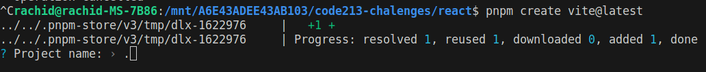
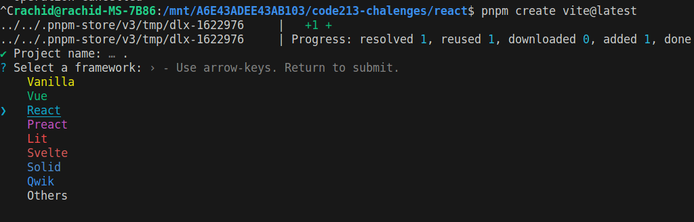
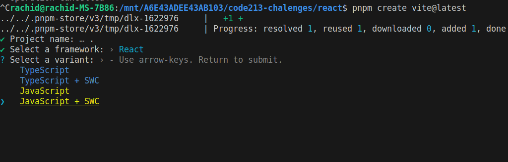
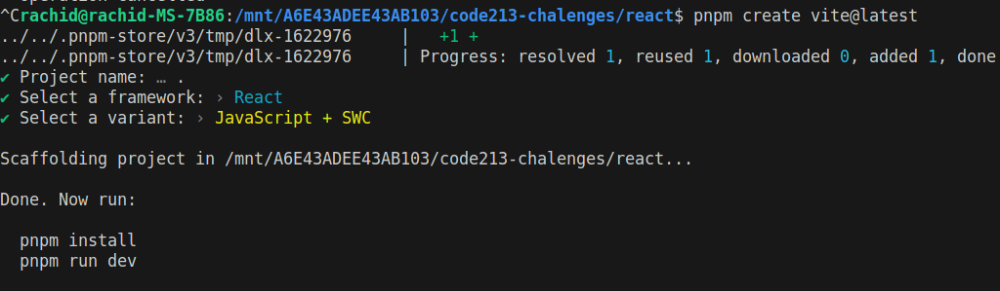

# Creating React Project

To create a new react project, create a new folder and open it in your terminal/cmd or vscode

then run the following command:

```bash
pnpm create vite@latest
```

Then you will be asked to choose a name for the project, just type `.`, this will create the react app in the current folder



Then you will be asked to choose a framework, choose `react`



Then you will be asked to choose a variant, choose `Javascript + SWC`



If all goes well you will see the following message:



## Installing dependencies

Our react project is created, but in order for it to work, we have to install the dependencies, to do that run the following command:

```bash
pnpm install
```

## Running the project

To run the project run the following command:

```bash
pnpm dev
```

Your react all will start in development mode and you can preview it in your browser at `http://localhost:5175/`

*While your app is in dev mode any changes you make to the code will reflect in the browser without the need to refresh the page and most of the time without losing the state of the app.*

## Exploring the project

1. `package.json` is the file that contains the project configuration and dependencies.

2. `index.html` is the main html file that will be loaded in the browser, if you check it's content you will see that it has a `div` with an id of `root` this is where our react app will be placed.

3. `src` folder is where all the react code will be placed, it contains the following files:

    1. `main.jsx` is the entry point of our react app, it contains the following code:

        ```jsx
        import React from 'react'
        import ReactDOM from 'react-dom/client'
        import App from './App.jsx'
        import './index.css'

        ReactDOM.createRoot(document.getElementById('root')).render(
            <React.StrictMode>
                <App />
            </React.StrictMode>,
        )
        ```

        We will talk about the code in this file later.

    2. `App.jsx` is the main component of our react app, it contains the following code:

        This component is the main component of our app, it contains the logo and the link to the react website.

    3. `App.css` is the css file for the `App.jsx` component, we will talk about styling react components later.