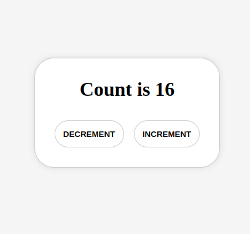
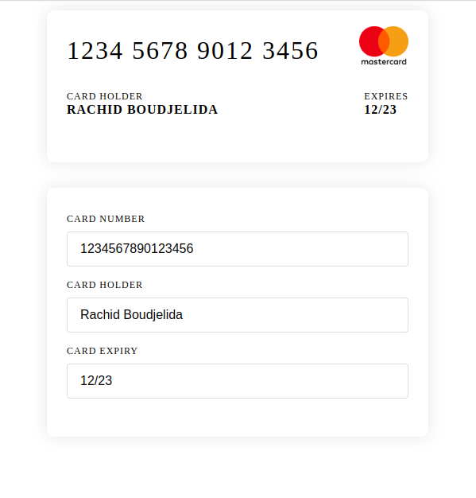

# 1. Incrementing a counter

Create A counter App

## Steps: 

1. Create a new react app using the following command:

    ```bash
    pnpm create vite@latest
    ```

    Then follow the instructions in the command line to create a react app.

2. Remove all the boilerplate code (index.css content, App.css content, App.jsx Component content)

3. In The `App.jsx` `App` component create a state variable called `counter` and initialize it with the value `0`

4. Display the value of the `counter` state variable in the `App` component
5. Add a button to the `App` component that when clicked will increment the value of the `counter` state variable by 1
6. Add a button to the `App` component that when clicked will decrement the value of the `counter` state variable by 1

## Screenshot:




# 2. Card Preview 

Similar to the the credit card review, create a card with a form underneath it, the form should have the following fields:

- Card Number
- Card Holder
- Card Expiry

When ever the user types in the input fields the card preview should be updated with the values of the input fields.

## Screenshot: 

