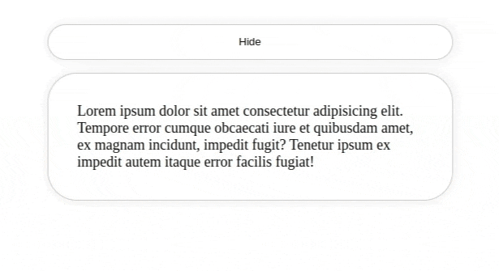

# 1. Toggle Display

1. Create a new react project.
2. Remove all the filler and boiler plate text
3. In the `App` component add a button and a paragraph.
4. If the button is clicked while the paragraph is visible , hide the paragraph, if the opposite show the paragraph instead.
5. **Bonus** Animate the paragraph when it is shown or hidden.



# 2. List Display

You are given the following array of Strings:

```js
const names = [
  "John",
  "Paul",
  "George",
  "Ringo",
  "Yoko",
  "George",
  "
];
```

1. Create a new react project.
2. Remove all the filler and boiler plate text
3. Add A heading with the text `Death Note`
4. Add An unordered list and add each name from the array as a list item.
5. **Bonus** Add a button to each list item that when clicked will remove the item from the list.
6. **Bonus** add an input and a button that when clicked will add the input value to the list.


# 3. List With Filters

You are given the following array of Fruits:
  
  ```js
  const fruits = [
    "Apple",
    "Banana",
    "Apple",
    "Orange",
    "Mango",
    "Pineapple",
    "Apple",
  ]
  ```

1. Create a new react project.
2. Remove all the filler and boiler plate text
3. Add A heading with the text `Fruits`
4. Add An unordered list and add each fruit from the array as a list item.
5. Add an input above the list, when the user types in the input the list should only show the fruits that contain the input value.


# 4. Frontent chalenge 

We are going to create this simple tip calculator:

Chalange: <https://www.frontendmentor.io/challenges/tip-calculator-app-ugJNGbJUX>


